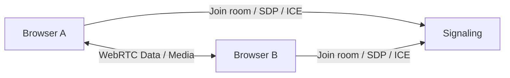

  <picture>
    <source media="(prefers-color-scheme: dark)" srcset="public/branding/weblink-logo-dark.svg" />
    
  </picture>

  <h3>Share more. Install less.</h3>

  

    A browser-native P2P workspace for file transfer, synchronization, chat,
    clipboard sharing, screen sharing, voice, and video — powered by WebRTC.
  

  

    <a href="https://webl.ink"><strong>Open Weblink</strong></a>
    ·
    <a href="docs/README.md">Documentation</a>
    ·
    <a href="README_CN.md">中文</a>
  

  

    
    
    
  

---

## A browser can be a peer-to-peer workspace

Weblink brings file sharing and real-time communication into one browser app.

Open the site on two devices, join the same room, and establish a WebRTC
connection. Once connected, chat, files, clipboard content, and media travel
through peer-to-peer channels rather than through the signaling service.

No native client is required.

## Why Weblink?

|                                                                                          |                                                                                                                                          |
| ---------------------------------------------------------------------------------------- | ---------------------------------------------------------------------------------------------------------------------------------------- |
| **⚡ WebRTC peer transfer** Send files and application data over WebRTC DataChannels. | **⏯ Resumable transfers** Continue interrupted file transfers from already cached chunks.                                            |
| **🔄 File synchronization** Browse and retrieve files exposed by connected peers.     | **💬 Real-time communication** Share text, clipboard content, voice, video, screens, and audio.                                       |
| **📦 Browser-native storage** Cache transferred files locally with IndexedDB.         | **🧭 Connection diagnostics** Inspect WebRTC connection details and run peer-to-peer throughput tests.                                |
| **📱 PWA integration** Install Weblink and use system sharing workflows.              | **🧩 Portable protocols** Signaling, control, file-transfer, and diagnostic wire contracts are documented for future non-Web clients. |

## One room, multiple workflows

### Files

- send files and folders directly between peers;
- optionally compress file chunks before transfer;
- resume interrupted transfers;
- keep completed files in a local browser cache;
- search local and peer-exposed cached files;
- forward or request files without leaving the room.

### Communication

- text chat over the P2P control channel;
- clipboard sharing between connected devices;
- camera and microphone sharing;
- screen sharing with optional system and microphone audio;
- picture-in-picture and media controls for live sessions.

### Diagnostics

- inspect ICE and connection state;
- see the active WebRTC route;
- run a versioned peer-to-peer throughput test;
- keep transfer and diagnostic activity visible through the unified task view.

## How it works

```mermaid
flowchart LR
    A[Browser A] -->|Join room / SDP / ICE| S[Signaling]
    B[Browser B] -->|Join room / SDP / ICE| S

    A <-->|WebRTC Data / Media| B
```

The signaling layer is used for peer discovery, room membership, and WebRTC
negotiation. After the peer connection is established, application traffic uses
WebRTC peer-to-peer channels.

When a room password is configured, Weblink can protect signaling payloads during
connection setup.

Display names and avatars are exchanged through the P2P control protocol rather
than published as signaling presence.

## Built with interoperability in mind

Weblink's P2P protocols are documented independently from the browser UI.

That includes:

- the signaling envelope and reconnect semantics;
- the typed P2P request/reply control protocol;
- the file-transfer DataChannel control frames and binary packet format;
- the versioned peer speed-test protocol.

This keeps the browser implementation from becoming the protocol specification
itself and leaves a clearer path for future desktop, mobile, CLI, or native
clients.

## Try Weblink

| Deployment   | Signaling backend                    | Open                             |
| ------------ | ------------------------------------ | -------------------------------- |
| **Primary**  | Cloudflare Workers + Durable Objects | [webl.ink](https://webl.ink)     |
| **Firebase** | Firebase Realtime Database           | [v.webl.ink](https://v.webl.ink) |

The primary deployment uses the open-source
[weblink-ws-worker](https://github.com/99percentpeople/weblink-ws-worker)
signaling backend.

## Learn more

- [Documentation](docs/README.md)
- [Architecture](docs/ARCHITECTURE.md)
- [P2P protocol](docs/P2P_PROTOCOL.md)
- [Deployment](docs/DEPLOYMENT.md)
- [Changelog](CHANGELOG.md)

---

  <strong>Weblink</strong> 
  Peer-to-peer tools, directly in the browser.

