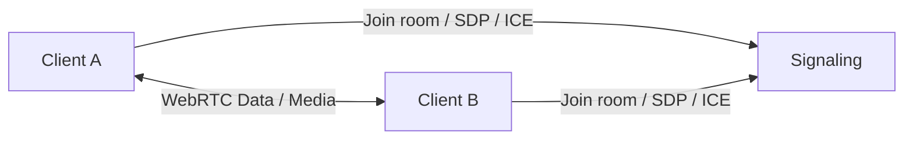

<div align="center">
  <picture>
    <source media="(prefers-color-scheme: dark)" srcset="apps/web/public/branding/weblink-logo-dark.svg" />
    
  </picture>

  <h3>Share more. Install less.</h3>

  <p>
    A WebRTC workspace for chat, file sharing, voice, video, and remote control.
    Use it in your browser or with the desktop app.
  </p>

  <p>
    <a href="https://webl.ink"><strong>Open Weblink</strong></a>
    ·
    <a href="docs/README.md">Documentation</a>
    ·
    <a href="README_CN.md">中文</a>
  </p>

  <p>
    <a href="https://github.com/99percentpeople/weblink/actions/workflows/ci.yml">
      
    </a>
    
    
  </p>
</div>

---

## Control your desktop from a browser

Connect to the desktop app from a browser on your phone or computer to view the
remote screen, use the mouse and keyboard, and transfer files. Weblink also
provides chat, a local file library, voice and video calls, and screen sharing,
with devices connected over WebRTC.

The Web app works without installing a native client. The desktop app
reuses the same interface and application code, adding native screen capture,
remote input, system clipboard access, and desktop window controls.

## Get started

1. Open **[webl.ink](https://webl.ink)** or launch the desktop app.
2. Choose a display name and room ID, and optionally set a room password.
3. Join the same room from another device using the same password. Invite others
   with a room link or QR code.
4. Open room chat or a private conversation, send files, or enable your microphone,
   camera, or screen share.

To control a remote computer, run the desktop app there and request control from
its participant or shared-display actions on another device. The host approves
the request or uses a previously saved allow rule. A request can start display
sharing after approval; window shares remain view-only.

Windows x64 installers are produced as the `weblink-windows-x64-installer`
artifact in successful stable-tag [CI runs](https://github.com/99percentpeople/weblink/actions/workflows/ci.yml).
Development runs produce a `weblink-windows-x64` executable artifact.
See [desktop setup and builds](docs/DESKTOP.md) for prerequisites and source builds.

## Web and desktop capabilities

| Capability                                      | Web                                               | Desktop (currently Windows)                                    |
| ----------------------------------------------- | ------------------------------------------------- | -------------------------------------------------------------- |
| Rooms, private chat, file library and transfers | Supported                                         | Supported                                                      |
| Camera and microphone                           | Browser device APIs                               | WebView device APIs                                            |
| Screen sharing                                  | Browser capture, where supported                  | Native display/window capture and supported system audio       |
| Remote control                                  | Control a compatible desktop host                 | Control another host or allow control of this computer         |
| Picture-in-picture                              | Available browser PiP APIs                        | Resizable, always-on-top native window                         |
| System integration                              | PWA installation and share target where supported | Tray, launch at login, close behavior and native notifications |

The supported desktop target is Windows 10 22H2 / Windows 11 on x64 with WebView2
120 or newer. Native system audio and input features depend on OS capabilities.
Browser media capture, clipboard access, notifications, and PWA integration depend
on browser support and permissions; use HTTPS or localhost for browser capture.

## Features

### Conversations and rooms

- Private conversations and online room group chat with text, file attachments,
  forwarding, delivery status, and locally stored history.
- Conversation search, labels, and activity ordering, alongside recent-room
  selection with saved connection details.
- Per-client and per-room settings for remote-control requests, access to shared
  files, and automatic downloads.
- Message, control-request, speed-test, and completed-transfer notifications,
  with configurable previews and sound. Windows notifications support inline
  replies and request approval.

### File library and transfers

- Import files or folders through a picker or drag and drop, and send or forward
  files from chat or the library. Folders are packaged as ZIP archives.
- Track progress, pause, resume, retry, or cancel transfers, reusing cached chunks
  and already available content.
- Keep a content-deduplicated local library with explicit sharing controls and a
  shared file list available across rooms.
- Browse a connected member's shared files with search, sorting, previews, and
  batch downloads. Downloads enter the library and task list without adding chat
  messages.
- Room attachments are downloaded on request by default. Enable small-file
  automatic downloads per room with a shared size limit in Transfer settings.

Importing or receiving a file does not automatically share it. Newly sent files
are shared automatically; sharing can be turned off in the library. Peers can
browse only complete, shared content when their file-list permission allows it.

### Meetings and screen sharing

- Share a camera, microphone, and multiple screens with grid or featured layouts,
  pinning, fullscreen, picture-in-picture, and independent audio controls.
- Adjust resolution, frame rate, and bitrate during a session, and choose audio
  formats supported by the current device and runtime.
- On Windows, select displays or windows with previews, use DXGI or Windows
  Graphics Capture, and choose available software encoders or H.264/HEVC hardware
  encoding. High-refresh options follow connected displays.
- Inspect stream statistics, ICE routes and connection state, and run peer
  throughput tests from the application.

HEVC requires a compatible hardware encoder and a receiver with H.265 support in
WebRTC. Native screen streams currently use 8-bit SDR YUV 4:2:0. Capture and codec
availability are reported by the application; see [native media details](docs/DESKTOP.md#native-screen-sharing).

### Remote control and clipboard

- Control a shared Windows display with a mouse and keyboard, including cursor
  appearance synchronization and configurable input-release and host emergency
  shortcuts.
- Use mobile trackpad gestures or direct multi-touch, soft-keyboard and IME input,
  configurable sampling, and optional keyboard visibility following remote text
  focus.
- Enable remote clipboard synchronization for text, rich text, images, and files.
  Copied files can go to the local clipboard or file library, depending on client
  capabilities; folders are transferred as ZIP archives.
- Enable file drag-and-drop onto the remote screen to copy local files into
  compatible Windows applications. This copies files into the remote computer;
  dragging files out into the controller's operating system is not supported.

Clipboard synchronization and remote file drop are off by default and require an
active control grant. Their file transfers share a per-operation size limit of
64 MiB by default, configurable from 1 to 512 MiB. Hosts can approve or decline
requests, remember a client's permission, and revoke control locally.
See [remote-control behavior](docs/DESKTOP.md#attended-remote-control).

## Connections and local data


```mermaid
flowchart LR
    A[Client A] -->|Join room / SDP / ICE| S[Signaling]
    B[Client B] -->|Join room / SDP / ICE| S

    A <-->|WebRTC Data / Media| B
```

Both browser and desktop clients use WebSocket signaling for room membership,
peer discovery, and WebRTC negotiation. Messages, files, remote input, and media
use WebRTC channels. When a direct route is unavailable, TURN can relay the
encrypted traffic.

Room passwords protect signaling payloads during negotiation. Display names and
avatars are exchanged over WebRTC rather than published in signaling presence.
The signaling service does not store chat history or files.

Room messages reach currently connected members; there is no server-side offline
message delivery. History, cached files, and preferences stay in the local browser
or desktop WebView profile. Browser and desktop storage are separate and are not
automatically synchronized. Access to a peer's shared files requires that peer to
be connected.

## Shared code and versions

The SolidJS + TypeScript application lives in `apps/web`. The Tauri app in
`apps/desktop` builds that same frontend with a desktop adapter, shared contracts
in `packages/platform`, and native capture/input implementations in `crates`.

The shared Web version and desktop package version are maintained independently.
Desktop About and copied version information show both; the browser shows its Web
version. Desktop updates currently require installing a newer package.

## Self-hosting

Host the static Web build or use the included Docker setup, then configure a
WebSocket signaling backend:

- [weblink-ws-worker](https://github.com/99percentpeople/weblink-ws-worker):
  Cloudflare Workers + Durable Objects, used by the public service.
- [weblink-ws-server](https://github.com/99percentpeople/weblink-ws-server):
  Bun server for self-hosting and LAN use.

Configure STUN/TURN for your network as needed. Signaling servers must support
the v2 join acknowledgment. See [deployment](docs/DEPLOYMENT.md) for hosting,
environment variables, managed TURN credentials, and LAN HTTP behavior.

## Development

Use the Bun version pinned in root `package.json` (currently 1.4.2). Clone the
repository with its signaling submodules:

```sh
git clone --recurse-submodules https://github.com/99percentpeople/weblink.git
cd weblink
bun install --frozen-lockfile
cp .env.example .env
bun dev
```

This starts the Web app and local Bun signaling. Configure ports and the local
signaling URL in `.env`. For an existing checkout, initialize submodules with
`git submodule update --init --recursive` before installing dependencies.

For desktop development, install the Windows prerequisites in
[desktop development](docs/DESKTOP.md). If `bun dev` is already running, reuse
its signaling server; otherwise, start local signaling in one terminal:

```sh
bun --env-file=.env run dev:server
```

Then start the desktop app in another terminal:

```sh
bun --env-file=.env run dev:desktop
```

Common checks and builds, also from the repository root:

```sh
bun run lint
bun run test:unit
bun run test:integration
bun run build
bun run check:desktop
bun run build:desktop --bundles nsis
```

The NSIS installer build runs on Windows. See [workspace development](docs/WORKSPACE.md)
for the repository layout and [testing](docs/TESTING.md) for focused checks.

## Learn more

- [Documentation](docs/README.md)
- [Architecture](docs/ARCHITECTURE.md)
- [Desktop behavior and development](docs/DESKTOP.md)
- [P2P protocol](docs/P2P_PROTOCOL.md)
- [File-transfer protocol](docs/FILE_TRANSFERS.md)
- [Deployment](docs/DEPLOYMENT.md)
- [Changelog](CHANGELOG.md)

---

<div align="center">
  <strong>Weblink</strong><br />
  Control your desktop and share files from your browser.
</div>
