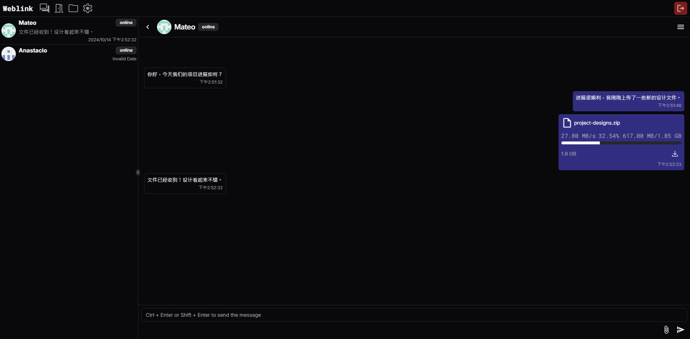

# Weblink

## Introduction

This is a pure web-based chat software built on WebRTC, supporting text chat, file transfer, video calls, and a serverless architecture powered by P2P connections, Firebase signaling, and Vercel deployment. No downloads are required, and it can be used directly in the browser.

This project is deployed on Vercel. [Click here to access](https://web1ink.vercel.app).

[**中文介绍**](README_CN.md)




## Features

- P2P connection

- Real-time text chat

- File transfer

- File storage

- Video calls

## Special Features

1. Chunked Transfer: Large files are divided into smaller chunks for gradual transfer, reducing the impact of network fluctuations and enabling the resumable transfer feature.

2. Resumable Transfer: Supports automatic recovery of file transfers after connection disruptions, allowing users to resume uploads or downloads without starting over.

3. Compressed Transfer: Enables file compression during transfer, compressing files in chunks to save bandwidth and improve transfer speed.

4. Multi-channel Data Transfer: Supports using multiple DataChannels for parallel transfers, improving data transfer performance and ensuring high speed even under heavy load.

5. Multi-party Chat: Different clients in the same room can connect to each other using a mesh network scheme.

6. IndexedDB File Caching: Transferred file chunks are cached in the browser's IndexedDB, preventing large files from occupying too much memory during transfers.

7. End-to-end Encryption: Uses symmetric encryption for end-to-end encrypted signaling, ensuring the privacy and security of signaling messages.

## Usage

### Run Locally

```base
git clone https://github.com/99percentpeople/weblink.git
cd weblink
pnpm install
```

Make sure you configure the Firebase keys in the project (as shown below), then run the following command:

```base
pnpm dev
```

### Deploy to Vercel

To deploy this project to Vercel, follow these steps:

1. Go to the Vercel website and log in (or create an account).

2. Connect your GitHub repository and select the cloned repository.

3. In your Vercel project settings, find "Environment Variables" and add the Firebase API key and other environment variables (as shown below).

4. Click the "Deploy" button, and Vercel will automatically build and deploy your project.

### Environment Variables Configuration (Firebase)

You will need to configure Firebase keys for both local development and deployment to Vercel. Add the following Firebase environment variables:

`VITE_FIREBASE_API_KEY`

`VITE_FIREBASE_AUTH_DOMAIN`

`VITE_FIREBASE_PROJECT_ID`

`VITE_FIREBASE_STORAGE_BUCKET`

`VITE_FIREBASE_MESSAGING_SENDER_ID`

`VITE_FIREBASE_APP_ID`

### Vercel Environment Variables Configuration

For Vercel deployment, set the environment variables by following these steps:

1. Open your Vercel project and go to "Settings."

2. Find "Environment Variables."

3. Add the Firebase configuration items above and input the corresponding values.

### Local Environment Variables (.env.local)

For local development, create a .env.local file and add the Firebase keys:

```env
VITE_FIREBASE_API_KEY=your-firebase-api-key
VITE_FIREBASE_AUTH_DOMAIN=your-firebase-auth-domain
VITE_FIREBASE_PROJECT_ID=your-firebase-project-id
VITE_FIREBASE_STORAGE_BUCKET=your-firebase-storage-bucket
VITE_FIREBASE_MESSAGING_SENDER_ID=your-firebase-messaging-sender-id
VITE_FIREBASE_APP_ID=your-firebase-app-id
```

## Notes

### Configuring TURN Server (Non-LAN Connections)

If you are using P2P connections outside a local area network (in a NAT environment), you may need to configure a TURN server to ensure connections are established. In the settings page, you can configure the TURN server with the following format:

**TURN Configuration Format:**

```
turn:turn1.example.com:3478|user1|pass1|longterm
turns:turn2.example.com:5349|user2|pass2|hmac
```

- turn: specifies the use of the standard TURN protocol (UDP/TCP).

- turns: specifies the use of a secure TURN protocol (TLS).

- example.com is the domain of your TURN server.

- 3478 and 5349 are the default TURN service ports (can be changed depending on server settings).

- user1 and user2 are the authentication usernames.

- pass1 and pass2 are the corresponding authentication passwords.

- longterm and hmac specify the authentication methods, representing long-term credentials and HMAC signed authentication.

## Contribution

Contributions are welcome! Please follow these steps:

1. Fork this repository

2. Create a branch (git checkout -b feature/your-feature)

3. Commit your changes (git commit -am 'Add some feature')

4. Push to the branch (git push origin feature/your-feature)

5. Create a Pull Request

## License

This project is open-sourced under the [MIT License](LICENSE).
