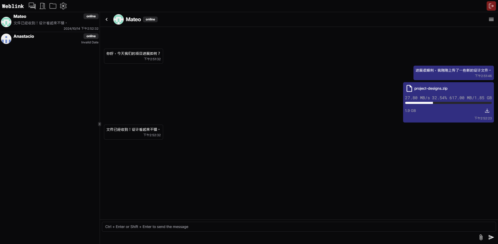
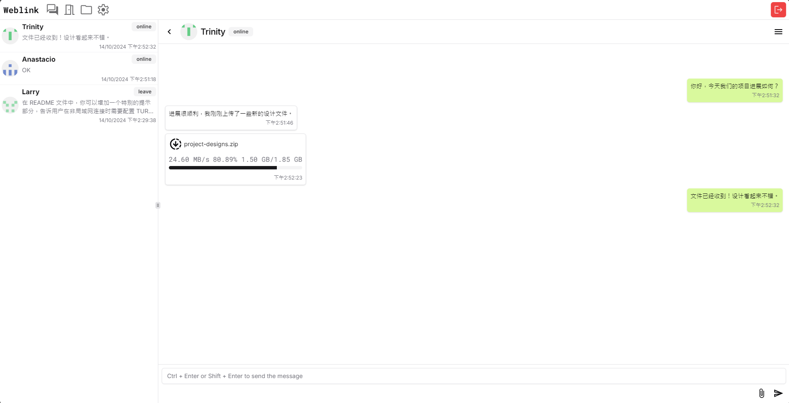

# Weblink

## 简介

这是一个基于 WebRTC 的纯 Web 聊天软件，支持文字聊天、文件传输、视频通话，并且通过 P2P 连接、Firebase 信令服务器和 Vercel 部署实现无服务器架构。无需下载，直接通过浏览器使用。

该项目已通过vercel部署，[点击访问](https://web1ink.vercel.app)。

[**Introduction in English**](README.md)





## 功能

- P2P连接
- 实时文字聊天
- 文件传输
- 文件存储
- 视频通话
- 无服务器架构

## 特色功能

1. **分块传输**：大文件会被分成小块逐步传输，以减少网络波动对传输的影响，并允许断点续传功能的实现。

2. **断点续传**：支持在文件传输过程中断开连接后自动恢复传输，用户无需重新上传或下载文件。

3. **压缩传输**：传输时可以开启压缩，将文件以区块为单位压缩后再传输，以节省带宽和提高传输速度。

4. **DataChannel 多通道传输**：支持使用多个 DataChannel 进行并行传输，提升数据传输性能，确保在高并发情况下仍然有良好的传输速度。

5. **多人聊天**：同一个房间的不同客户端可以互相连接，采用Mesh方案。

6. **IndexedDB 文件缓存**：传输的文件区块缓存在浏览器的 IndexedDB 中，避免传输大文件时占用过多内存。

7. **端到端加密**：使用对称式加密技术，所有信令均通过加密传输，确保信令消息的隐私和安全。

## 使用方法

### 本地运行

```bash
git clone https://github.com/99percentpeople/weblink.git
cd weblink
pnpm install
```

确保你已经在项目中配置了 Firebase 的密钥（如下所示），然后运行以下命令：

```bash
pnpm dev
```

### 部署到 Vercel

你可以通过以下步骤将项目部署到 Vercel：

1. 前往 Vercel 网站 并登录（或创建一个账号）。
2. 连接你的 GitHub 仓库，选择你克隆的仓库。
3. 在 Vercel 项目设置中，找到 Environment Variables（环境变量），添加你的 Firebase API 密钥等环境变量（如下所示）。
4. 单击 "Deploy" 按钮，Vercel 将自动构建并部署你的项目。

### 环境变量配置 (Firebase)

在本地开发和部署到 Vercel 时，你需要配置 Firebase 的密钥。以下是需要添加的 Firebase 环境变量：

`VITE_FIREBASE_API_KEY`

`VITE_FIREBASE_AUTH_DOMAIN`

`VITE_FIREBASE_PROJECT_ID`

`VITE_FIREBASE_STORAGE_BUCKET`

`VITE_FIREBASE_MESSAGING_SENDER_ID`

`VITE_FIREBASE_APP_ID`

`VITE_FIREBASE_DATABASE_URL`

### Vercel 环境变量配置

部署到 Vercel 时，请按照以下步骤设置环境变量：

1. 打开你的 Vercel 项目，进入 "Settings"。

2. 找到 Environment Variables。

3. 分别添加上述 Firebase 配置项，将对应的值填入字段中。

### 本地环境变量 (.env.local)

在本地开发时，创建一个 .env.local 文件，将 Firebase 密钥添加到其中：

```env
VITE_FIREBASE_API_KEY=your-firebase-api-key
VITE_FIREBASE_AUTH_DOMAIN=your-firebase-auth-domain
VITE_FIREBASE_PROJECT_ID=your-firebase-project-id
VITE_FIREBASE_STORAGE_BUCKET=your-firebase-storage-bucket
VITE_FIREBASE_MESSAGING_SENDER_ID=your-firebase-messaging-sender-id
VITE_FIREBASE_APP_ID=your-firebase-app-id
VITE_FIREBASE_DATABASE_URL=your-database-url
```

## 注意事项

### 配置 TURN 服务器（非局域网连接）

如果你在非局域网（NAT 环境）下使用 P2P 连接，可能需要配置 TURN 服务器以确保能够建立连接。在设置页面中，你可以根据以下格式配置 TURN 服务器：

**TURN 配置格式**：

```
turn:turn1.example.com:3478|user1|pass1|longterm
turns:turn2.example.com:5349|user2|pass2|hmac
```

- `turn:` 表示使用普通的 TURN 协议（UDP/TCP）。
- `turns:` 表示使用安全的 TURN 协议（TLS）。
- `example.com` 是你配置的 TURN 服务器域名。
- `3478` 和 `5349` 是 TURN 服务的默认端口（可以根据服务器设置更改）。
- `user1` 和 `user2` 是认证用户名。
- `pass1` 和 `pass2` 是对应的认证密码。
- `longterm` 和 `hmac` 表示认证方法，分别为长期凭证和 HMAC 签名认证。

## 贡献

欢迎贡献代码！请遵循以下步骤：

1. Fork 本仓库

2. 创建一个分支 (git checkout -b feature/your-feature)

3. 提交你的更改 (git commit -am 'Add some feature')

4. 推送到分支 (git push origin feature/your-feature)

5. 创建一个 Pull Request

## 许可证

该项目基于 [MIT License](LICENSE) 开源。
